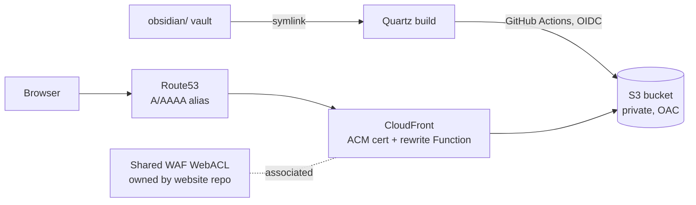

# notes

Source for [notes.rickwaterman.com](https://notes.rickwaterman.com) — Rick Waterman's
engineering knowledge base: terse, example-first reference notes on AWS, distributed
systems, databases, DevOps tooling, security, and the command line.

The notes are an [Obsidian](https://obsidian.md/) vault (`obsidian/`) published as a static
site with [Quartz](https://quartz.jzhao.xyz/) v5 (`quartz/`) and deployed to S3 +
CloudFront with AWS CDK (`infra/`). It is a sibling of
[`website`](https://github.com/rwaterman/website) and
[`blog`](https://github.com/rwaterman/blog), which share the same deployment pattern and
account-wide infrastructure.

## Requirements

- Node.js 22 (`quartz/.node-version`)
- `yq` (CI uses it to set `baseUrl` per environment)
- AWS CLI + CDK bootstrap in `us-west-2` and `us-east-1` for infra work

## Write notes

Open `obsidian/` as a vault in Obsidian. Plain Markdown with wikilinks, callouts, and
frontmatter (`title`, `description`, optional `date`). `obsidian/index.md` is the site
home page and the hand-curated map of content; add new notes to the matching topic
folder and link them from there.

Folders ignored at build time (`ignorePatterns` in `quartz.config.yaml`): `private`,
`templates`, `Unsorted`, `.obsidian`. Drop half-finished notes in `Unsorted/` and they
stay out of the published site.

`obsidian/ai-disclosure.md` describes how AI tools are used.

## Develop

```sh
cd quartz
npm ci
npx quartz plugin install   # fetches github:quartz-community/* plugins into .quartz/plugins
npx quartz build --serve    # http://localhost:8080, rebuilds on change
```

`quartz/content` is a symlink to `../obsidian`, so the vault is the single source of
truth and Quartz reads it in place.

## Layout

```
.obsidian/                shared vault settings (workspace state is gitignored)
obsidian/                 the vault — published content
  index.md                home page / map of content
  AWS/ AI/ CLI/ Databases/ DevOps/ Operating Systems/ Programming/
  Security/ Software Architecture/ Sources/ Unsorted/
quartz/                   Quartz v5 (vendored upstream + config)
  content -> ../obsidian
  quartz.config.yaml      site config, theme, plugin list
  quartz.lock.json        pinned plugin versions
  plugins/search-shortcut local component plugin: "/" opens search (hand-written dist/, no build)
  public/                 build output (gitignored)
infra/                    AWS CDK app (TypeScript)
  bin/
  lib/shared-stack.ts     notes-infra-deploy role, imports shared OIDC provider (us-west-2)
  lib/cert-stack.ts       per-env ACM certificate (us-east-1)
  lib/site-stack.ts       one environment (us-west-2)
  lib/site-config.ts      SITE_ENVS, account/region/zone
.github/workflows/
  deploy.yml              build + publish content
  infra.yml               cdk deploy
```

## Site

Quartz is configured in `quartz/quartz.config.yaml` (v5 YAML config; plugins are
`github:quartz-community/*` packages pinned in `quartz.lock.json`). Notable choices:

- Title "Engineering Knowledge Base", `baseUrl` rewritten per environment by CI.
- Nord palette, locked to dark mode via the `quartz-themes` preset; Space Grotesk /
  Inter / JetBrains Mono from Google Fonts.
- Explorer, full-text search (`/`), graph view, backlinks, breadcrumbs, link popovers,
  SPA navigation, syntax highlighting, created/modified dates from frontmatter → git →
  filesystem, RSS + sitemap, OG images.
- Plausible analytics.

## Architecture



The home region is `us-west-2`; everything that can live there does (bucket,
distribution, roles, SSM). CloudFront requires its ACM certificate in `us-east-1`, so
each environment gets a thin `NotesCert<Env>` stack there whose certificate is passed to the
home-region site stack with CDK `crossRegionReferences`. DNS is the `rickwaterman.com`
hosted zone.

| Stack | Region | Contents |
| --- | --- | --- |
| `NotesShared` | us-west-2 | `notes-infra-deploy` role (imports the website repo's OIDC provider) |
| `NotesCert<Env>` | us-east-1 | That environment's DNS-validated ACM certificate |
| `NotesSite<Env>` | us-west-2 | Bucket, distribution, DNS, content role, SSM params |

### `NotesShared`

Imports the account-wide GitHub OIDC provider (created once by the `website` repo's
`WebsiteShared` stack) and creates the `notes-infra-deploy` role that `infra.yml` assumes
from `develop`. The role has no service permissions of its own — it can only assume the
CDK bootstrap roles in both regions.

### `NotesSite<Env>`

| Env | Stack | Domain | Deploys from | Content role |
| --- | --- | --- | --- | --- |
| dev | `NotesSiteDev` | `notes-dev.rickwaterman.com` | `develop` | `notes-content-dev` |
| prod | `NotesSiteProd` | `notes.rickwaterman.com` | `main` | `notes-content-prod` |

Each environment stack creates: a private, encrypted S3 bucket (prod: `RETAIN`, dev:
destroy + auto-empty); a CloudFront distribution with Origin Access Control, a
viewer-request CloudFront Function that maps `/foo/` to `index.html` and extensionless
`/foo` to `foo.html` (Quartz emits flat pages), and 403/404 mapped to Quartz's
`/404.html`; Route53 A/AAAA alias records; a
branch-scoped OIDC role that may only write to that environment's bucket and invalidate
its distribution; and SSM parameters `/notes/<env>/bucket-name` and
`/notes/<env>/distribution-id` that the deploy workflow resolves at run time.

The distribution attaches the shared CloudFront WebACL (geo-block of sanctioned
countries, per-IP rate limit, AWS IP-reputation list) by reading its ARN from SSM
`/website/shared/cloudfront-webacl-arn` (us-west-2) at deploy time, so WAF rules are
defined in one place for all three sites.

## CI/CD

Both workflows use OIDC (`id-token: write`) and the repo secrets `AWS_ACCOUNT_ID` and
`HOSTED_ZONE_ID`; no long-lived AWS keys exist.

- **`deploy.yml`** — on push to `develop` (→ dev) or `main` (→ prod), or
  `workflow_dispatch` with an `env` choice. Checks out full history (`fetch-depth: 0`,
  so created/modified dates come from git), restores the plugin cache (keyed on
  `quartz.lock.json`), runs `npm ci` + `quartz plugin install`, sets `baseUrl` with `yq`,
  runs `quartz build`, writes `robots.txt` (`Disallow: /` on dev, `Allow: /` + sitemap on
  prod), assumes `notes-content-<env>`, syncs `quartz/public/` to S3 with
  `must-revalidate` cache headers, then invalidates `/*`.
- **`infra.yml`** — on push to `develop` touching `infra/**`. Assumes
  `notes-infra-deploy` and runs `cdk deploy --all` — every stack, dev **and** prod.
  Infra has no `main` path; only content promotion follows `main`.

Branching follows git flow: feature branches → `develop` (dev), releases → `main` (prod).

### First-time / local infra deploy

`notes-infra-deploy` is created by `NotesShared`, so the very first deploy runs locally
with admin credentials, after the `website` repo's `WebsiteShared` stack exists:

Both regions must be CDK-bootstrapped.

```sh
cd infra && npm ci
AWS_ACCOUNT_ID=<account> HOSTED_ZONE_ID=<zoneId> npx cdk deploy --all --require-approval never
```
