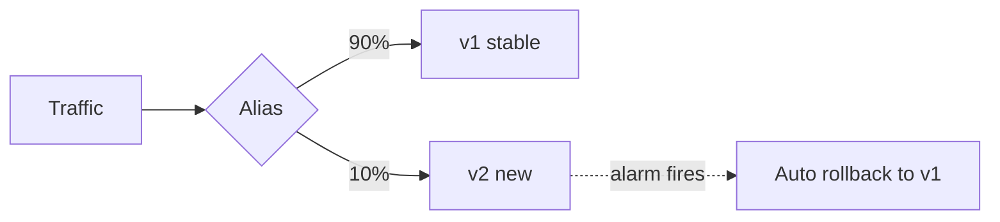

# Canary Deployments

Shift a small slice of traffic to a new version, watch metrics, then ramp up — or roll back automatically if alarms fire. Limits blast radius compared to all-at-once cutovers.



## Lambda — Alias Traffic Shifting

- Publish an immutable **version**; point an **alias** (e.g. `prod`) at it.
- The alias splits weighted traffic between two versions (`routing-config`).
- Combine with **CodeDeploy** for automated, monitored shifts.

```bash
# Send 10% of prod traffic to the new version
aws lambda update-alias \
  --function-name my-fn --name prod \
  --function-version 42 \
  --routing-config '{"AdditionalVersionWeights":{"43":0.1}}'
```

## CodeDeploy Deployment Configs

- **Canary** — `Canary10Percent5Minutes`: 10% for 5 min, then 100%.
- **Linear** — `Linear10PercentEvery1Minute`: +10% on an interval.
- **AllAtOnce** — immediate cutover (use for dev only).
- **Pre/Post-traffic hooks** (Lambda) run validation; **CloudWatch alarms** trigger automatic rollback.

## SAM / Serverless Framework

```yaml
# AWS SAM
AutoPublishAlias: prod
DeploymentPreference:
  Type: Canary10Percent5Minutes
  Alarms:
    - !Ref MyFnErrorAlarm
```

## References

- [Implementing Canary Deployments of AWS Lambda Functions with Alias Traffic Shifting](https://aws.amazon.com/blogs/compute/implementing-canary-deployments-of-aws-lambda-functions-with-alias-traffic-shifting/)
- Serverless plugin: `git@github.com:davidgf/serverless-plugin-canary-deployments.git`

> [!note] Related
> Other progressive strategies: **blue/green** (two full environments, swap), **rolling** (replace instances in batches). Canary is blue/green with a metered ramp.
