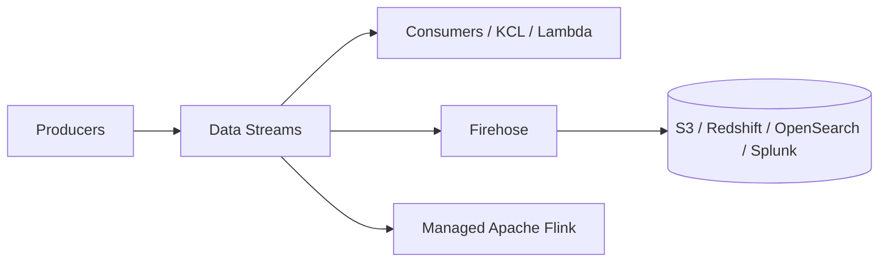

# Kinesis

Managed real-time data streaming — the AWS alternative to Apache Kafka. Four services under one name; **Data Streams** and **Firehose** are the ones you'll reach for most.

- Great for application logs, metrics, IoT telemetry, clickstreams.
- Feeds stream-processing frameworks (Spark, Flink, etc.).
- Data is replicated synchronously across 3 AZs.

## Kinesis Data Streams

Low-latency ingest at scale. Streams are split into ordered **shards**.

- Records up to **1 MB**; ordering is per-shard (by partition key).
- **Retention: 24 h default, extendable to 365 days.**
- Replay/reprocess supported; once written, records are immutable.
- Multiple applications can consume the same stream independently.

### Capacity Modes

**Provisioned** — you choose the shard count.
- Each shard: **1 MB/s or 1000 records/s in**; **2 MB/s out** (shared across classic consumers).
- Exceeding write limits → `ProvisionedThroughputException`.
- Pay per shard-hour. Use when throughput is predictable.

**On-Demand** — no capacity to manage.
- Starts at 4 MB/s (4000 records/s), scales automatically with observed peak (last 30 days), up to 200 MB/s.
- Pay per stream-hour + data in/out. Use when throughput is spiky/unknown.

### Consumers

- **Classic / shared fan-out** — 2 MB/s per shard shared across all consumers; 5 `GetRecords` calls/s per shard.
- **Enhanced fan-out** — dedicated **2 MB/s per consumer per shard** via push (HTTP/2), lower latency, for many parallel consumers.
- Libraries: **KCL** (consumer, checkpoints to DynamoDB), **KPL** (producer, batching/aggregation), or trigger **Lambda** directly.

## Kinesis Data Firehose

Near-real-time **delivery** (not storage) — load streams into destinations with no code.

- Destinations: **S3, Redshift, OpenSearch, Splunk**, HTTP endpoints, and 3rd-party (Datadog, New Relic, etc.).
- Fully managed, auto-scaling; buffers by **size or time**.
- **Transform** records in-flight with Lambda (e.g. CSV → JSON).
- **Format conversion** to Parquet/ORC; compression (GZIP, Snappy, ZIP) for S3.
- Failed/all records can be backed up to an S3 bucket.

## Managed Service for Apache Flink

> [!note] Renamed
> Formerly **Kinesis Data Analytics**. SQL applications are deprecated — use Apache Flink.

- Real-time analytics on streams via Flink (or SQL on legacy apps).
- Streaming ETL, continuous metric generation, responsive analytics/alerting.
- Serverless, pay for resources consumed.
- Built-in ML SQL functions on legacy apps: `RANDOM_CUT_FOREST` (anomaly detection on numeric columns), `HOTSPOTS` (dense regions).

## Kinesis Video Streams

- Stream video/audio/RADAR in real time; **1 stream per feed**.
- Retention: 1 hour to 10 years; playback supported.
- Consumers: SageMaker, Amazon Rekognition Video, or your own (TensorFlow/MXNet).
- Producers: cameras, smartphones, body cams, RTSP devices (via Producer SDK).

## Choosing

| Need | Service |
|---|---|
| Custom real-time processing, replay, multiple consumers | Data Streams |
| Zero-code load into S3/Redshift/OpenSearch | Firehose |
| Stateful stream analytics / windowing | Managed Apache Flink |
| Video ingest & ML | Video Streams |
