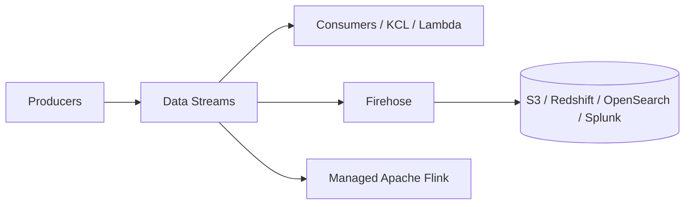

# Kinesis

Managed real-time streaming — the AWS Kafka alternative. **Data Streams** (ingest + fan-out) and **Firehose** (delivery) are the two that matter; Managed Apache Flink does stateful stream analytics on top.

## Data Streams

Ordered **shards**; ordering is per-shard by partition key. Records ≤ **1 MB**, immutable once written, replayable. **Retention 24 h default → 365 days.** Many independent consumers per stream.

| | Provisioned | On-Demand |
|---|---|---|
| Capacity | You pick shard count | Auto (starts 4 MB/s, tracks 30-day peak, up to 200 MB/s) |
| Per shard | 1 MB/s or 1000 rec/s in; 2 MB/s out | — |
| Over limit | `ProvisionedThroughputException` | — |
| Pay | Shard-hour | Stream-hour + data |
| Use | Predictable | Spiky / unknown |

**Consumers**
- Shared fan-out — 2 MB/s per shard shared by all consumers; 5 `GetRecords`/s per shard.
- **Enhanced fan-out** — dedicated 2 MB/s per consumer per shard, push over HTTP/2.
- **KCL** (consumer; checkpoints in DynamoDB), **KPL** (producer; batching/aggregation), or a **Lambda** event source mapping.

## Firehose

Near-real-time **delivery**, zero code: S3, Redshift, OpenSearch, Splunk, HTTP endpoints, Datadog/New Relic. Buffers by size or time; optional Lambda transform, Parquet/ORC conversion, compression, failed-record backup to S3.

## Managed Service for Apache Flink

Formerly Kinesis Data Analytics (SQL apps deprecated). Windowing, joins, stateful processing over streams.

## Choosing

| Need | Service |
|---|---|
| Custom processing, replay, many consumers | Data Streams |
| Zero-code load into S3/Redshift/OpenSearch | Firehose |
| Stateful analytics / windowing | Managed Apache Flink |
| Video ingest for ML | Kinesis Video Streams |
