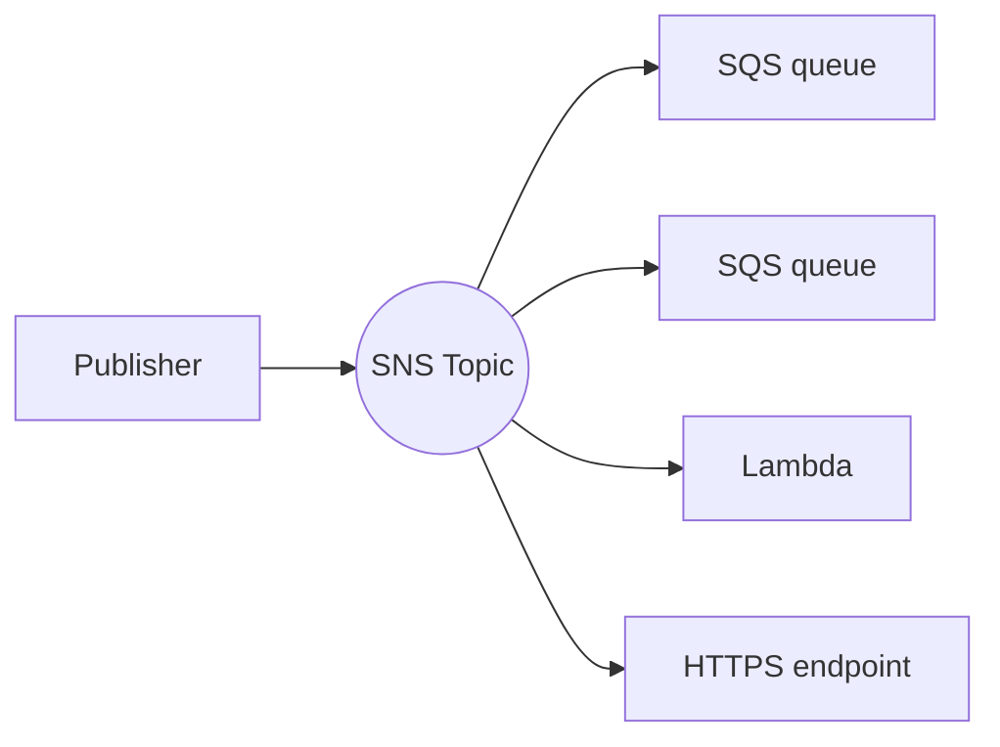

# SNS

Managed pub/sub. Publishers send to a **topic**; SNS pushes each message to all **subscribers**. Decouples one event from many reactions.

## Subscribers

- SQS, Lambda, HTTP/S, email, SMS, mobile push, and Kinesis Data Firehose.
- **Push**-based — no polling. SNS retries failed deliveries; pair with a **DLQ** per subscription.

## Patterns

- **Fan-out** — SNS → multiple [[SQS]] queues so several services process the same event independently and durably.
- **Message filtering** — subscription **filter policies** route only matching messages (filter on attributes or message body) — subscribers get just what they care about.

## Standard vs FIFO

- **FIFO topics** preserve ordering and dedup, but only deliver to **FIFO SQS** queues.
- **Standard** topics: higher throughput, best-effort ordering, can deliver to any subscriber type.

## Notes

- Max message size 256 KB.
- Encryption in transit by default; at rest via KMS.

> [!tip] vs EventBridge
> SNS is high-throughput, low-latency fan-out with simple filtering. [[EventBridge]] adds content-based routing, SaaS sources, schema registry, and archive/replay — at higher latency. Choose by routing complexity.
