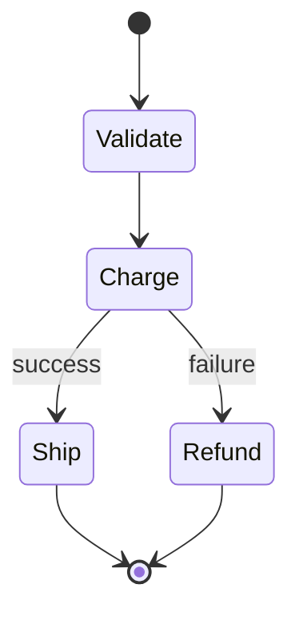

# Step Functions

Serverless workflow orchestration. You define a **state machine** in **Amazon States Language (ASL, JSON)**; AWS runs it, tracks state, retries, and gives you a visual execution history — so you don't hand-roll orchestration logic in a Lambda.

## Standard vs Express

| | Standard | Express |
|---|---|---|
| Max duration | 1 year | 5 min |
| Execution semantics | Exactly-once | At-least-once / at-most-once |
| Throughput | Lower | Very high (>100k/s) |
| Pricing | Per state transition | Per duration + memory |
| History | Full, in console | Via CloudWatch Logs |
| Use case | Long-running, auditable | High-volume event processing |

## State Types

- **Task** — do work (Lambda, or 200+ service integrations).
- **Choice** — branch on input.
- **Parallel** — run branches concurrently.
- **Map** — fan out over an array; **Distributed Map** scales to millions of items (up to 10k parallel) over S3/JSON.
- **Wait / Pass / Succeed / Fail** — delay, inject, terminate.

## Error Handling

- **Retry** — backoff on matched errors (`ErrorEquals`, `IntervalSeconds`, `MaxAttempts`, `BackoffRate`).
- **Catch** — route failures to a fallback state.
- This built-in resilience is the main reason to use Step Functions over chained Lambdas.

## Service Integration Patterns

- **Request/Response** — call and continue.
- **Run a Job (`.sync`)** — call and wait for completion (e.g. ECS task, Glue job).
- **Wait for Callback (`.waitForTaskToken`)** — pause until an external system returns a token (human approval, third-party webhook).

> [!tip] vs EventBridge
> Step Functions orchestrates a *known* sequence of steps. [[EventBridge]] *routes* events between decoupled services with no central flow. Use both: events trigger workflows.
