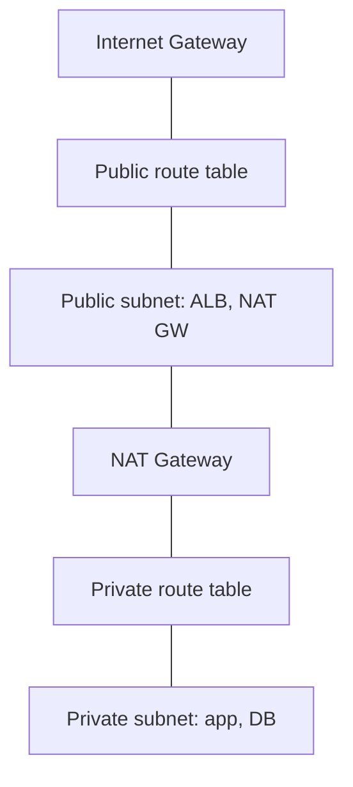

# VPC

A logically isolated virtual network in your AWS account. You define the IP range, carve it into subnets across AZs, and control routing and firewalling.

## Building Blocks

- **CIDR block** — the VPC's IP range (e.g. `10.0.0.0/16`). Plan for growth; avoid overlaps with peers/on-prem.
- **Subnets** — AZ-scoped slices. **Public** = route to an Internet Gateway; **private** = no direct inbound from the internet.
- **Route tables** — direct traffic per subnet (local, IGW, NAT, endpoints, peering).
- **Internet Gateway (IGW)** — horizontally scaled, gives public subnets internet access.
- **NAT Gateway** — managed egress for private subnets (AZ-bound; deploy one per AZ for HA). Replaces legacy NAT instances.

## Firewalls — SG vs NACL

| | Security Group | Network ACL |
|---|---|---|
| Level | Instance / ENI | Subnet |
| State | **Stateful** (return traffic auto-allowed) | **Stateless** (must allow both directions) |
| Rules | Allow only | Allow **and** deny |
| Evaluation | All rules | Numbered order, first match wins |

Default to **security groups**; reach for NACLs for coarse subnet-level deny rules.

## VPC Endpoints (keep traffic off the internet)

- **Gateway endpoint** — S3 and DynamoDB only; route-table entry; **free**.
- **Interface endpoint (PrivateLink)** — ENI in your subnet for most other services; hourly + data cost.

## Connecting VPCs / On-Prem

- **VPC Peering** — 1:1, **non-transitive**; fine for a few VPCs.
- **Transit Gateway** — hub-and-spoke for many VPCs + on-prem (VPN / Direct Connect).
- **VPN** (over internet) / **Direct Connect** (dedicated link) for hybrid.

## Observability

- **Flow Logs** — capture accepted/rejected traffic metadata to CloudWatch Logs or S3 (security forensics, debugging connectivity).

> [!tip] Lambda in a VPC
> Only put Lambda in a VPC when it must reach private resources (RDS, internal services). It adds ENI management; use VPC endpoints to still reach AWS APIs without a NAT Gateway.
