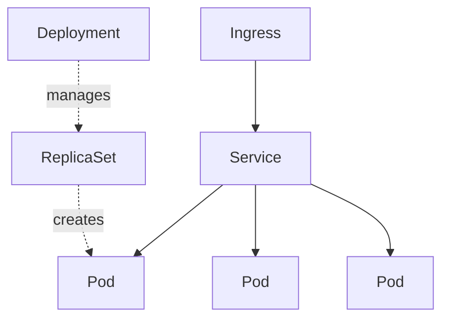

# Kubernetes

Container orchestration: declare the desired state of your workloads and K8s continuously reconciles reality toward it — scheduling, scaling, healing, and networking containers across a cluster.

## Core Objects

- **Pod** — smallest unit; one or more tightly-coupled containers sharing network/storage. Ephemeral.
- **ReplicaSet** — keeps N identical pods running.
- **Deployment** — manages ReplicaSets; declarative rollouts + rollbacks.
- **Service** — stable virtual IP/DNS in front of a set of pods (`ClusterIP`, `NodePort`, `LoadBalancer`).
- **Ingress** — HTTP(S) routing + TLS into Services (via an ingress controller).
- **ConfigMap / Secret** — externalized config and sensitive values.
- **Namespace** — virtual cluster partition for multi-tenant/env isolation.



## Reconciliation Loop
The **control plane** (API server, scheduler, controller-manager, etcd) watches desired vs actual state and acts. You change *desired* state declaratively; controllers do the rest.

## Scaling & Health
- **HPA** — Horizontal Pod Autoscaler scales pods on CPU/memory/custom metrics.
- **Liveness / readiness / startup probes** — restart unhealthy pods, gate traffic until ready.
- **Requests/limits** — schedule and cap pod resources.

## kubectl

```bash
kubectl get pods -n my-ns
kubectl describe pod <name>
kubectl logs -f <pod> [-c container]
kubectl apply -f deploy.yaml
kubectl rollout status deploy/my-app
kubectl rollout undo deploy/my-app
```

## On AWS & Tooling
- **EKS** — managed Kubernetes control plane; pair with Fargate or managed node groups.
- **Helm** — package manager (charts) for templated releases.
- **Manifests** are usually GitOps-managed (Argo CD, Flux).

> [!tip] Do you need it?
> Kubernetes is powerful but operationally heavy. For most AWS services, [[ECS & Fargate]] or [[Lambda]] deliver the outcome with far less overhead. Choose K8s for portability or a rich ecosystem need.
