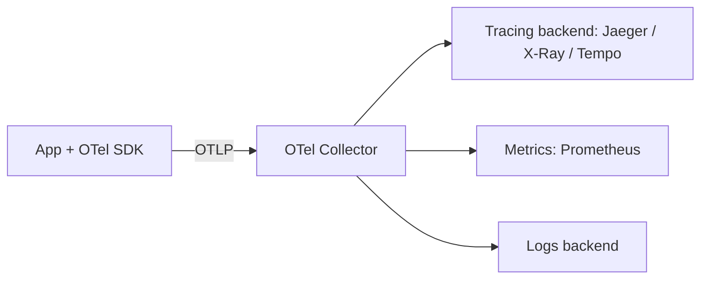

# OpenTelemetry

CNCF vendor-neutral standard for generating and exporting telemetry. Instrument **once**, route anywhere.

## Three Signals

- **Traces** — a request's path across services as a tree of **spans** (timing, attributes, status).
- **Metrics** — counters, gauges, histograms.
- **Logs** — correlated to traces via trace/span IDs.

## Architecture



- **API + SDK** — API is stable; SDK does sampling, batching, export.
- **Instrumentation** — *auto* (HTTP, DB, frameworks) vs *manual* (custom spans for business logic).
- **Collector** — receive → process (batch, filter, enrich) → export. Swap vendors without re-instrumenting.
- **OTLP** — the wire protocol. Exporters: Jaeger, Prometheus, AWS X-Ray (via ADOT), Datadog, …
- **Context propagation** — W3C `traceparent` header stitches spans across process boundaries.
- **Semantic conventions** — standard attribute names (`http.request.method`, `db.system`).

## Node.js zero-code instrumentation

```bash
npm i @opentelemetry/api @opentelemetry/auto-instrumentations-node

# Local check: print spans to stdout
OTEL_SERVICE_NAME=my-svc OTEL_TRACES_EXPORTER=console \
OTEL_METRICS_EXPORTER=none OTEL_LOGS_EXPORTER=none \
node --require @opentelemetry/auto-instrumentations-node/register app.js

# Real backend: OTLP to a collector
OTEL_SERVICE_NAME=my-svc OTEL_EXPORTER_OTLP_ENDPOINT=http://localhost:4318 \
node --require @opentelemetry/auto-instrumentations-node/register app.js
```

Inbound `http` and outbound `fetch`/`undici` calls appear as spans with no code changes. Exporter batches flush on a timer (`OTEL_BSP_SCHEDULE_DELAY`, default 5000 ms) and on `SIGTERM`; `process.exit()` skips the flush.

Pairs with [[Prometheus]] for metrics; feeds the four golden signals in the [[Production Readiness Checklist]].
