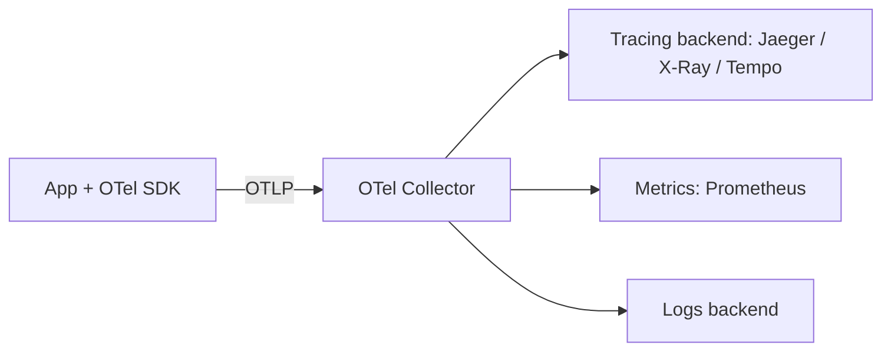

# OpenTelemetry

> Observability is how well you can infer a system's internal state from its external outputs.

OpenTelemetry (OTel) is a CNCF, vendor-neutral standard for generating and exporting telemetry. It was born in the cloud-native era — distributed systems (Lambdas, containers) need consistent, portable instrumentation instead of per-vendor agents.

## Three Signals

- **Traces** — the path of a request across services as a tree of **spans** (each with timing, attributes, status). The backbone of distributed debugging.
- **Metrics** — aggregated numeric measurements over time (counters, gauges, histograms).
- **Logs** — timestamped records, correlated to traces via trace/span IDs.

## Architecture

- **API + SDK** — instrument code (per language); the API is stable, the SDK does sampling/batching/export.
- **Instrumentation** — *auto* (drop-in for popular libs/HTTP/DB) vs *manual* (custom spans/attributes for business logic).
- **Collector** — receive → process (batch, filter, enrich) → export. Decouples your app from backends; swap vendors without re-instrumenting.
- **OTLP** — the wire protocol; **exporters** send to Jaeger, Prometheus, AWS X-Ray (via ADOT), Datadog, etc.
- **Context propagation** — pass trace context across service/process boundaries (W3C `traceparent`) so spans stitch into one trace.
- **Semantic conventions** — standard attribute names (`http.method`, `db.system`) so backends understand data uniformly.

## Why It Matters
Instrument **once** against OTel, then route telemetry anywhere — no vendor lock-in. Pairs with [[Prometheus]] for metrics and feeds the four golden signals in your [[Production Readiness Checklist]].
