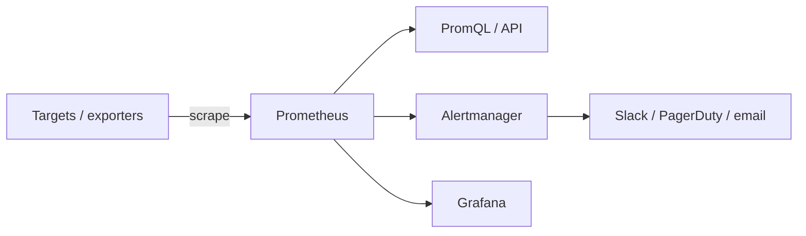

# Prometheus

Open-source metrics monitoring and alerting. Prometheus **scrapes** (pulls) numeric time-series from instrumented targets, stores them locally, and lets you query and alert with **PromQL**. CNCF's second graduated project (after Kubernetes); written in Go.

## Data Model

- A time series = **metric name** + **labels** (key/value dimensions) → a stream of timestamped samples.
- `http_requests_total{method="get", status="200"}` — name `http_requests_total`, labels `method`/`status`.
- Metric types: **counter** (monotonic ↑), **gauge** (up/down), **histogram** (bucketed), **summary** (quantiles).

## Architecture



- **Pull model** — Prometheus scrapes `/metrics` endpoints (vs push). Short-lived jobs push via the **Pushgateway**.
- **Exporters** — expose third-party systems as metrics: `node_exporter` (host), `blackbox_exporter` (probes), DB/queue exporters.
- **Service discovery** — auto-find targets (Kubernetes, EC2, Consul).
- **Alertmanager** — dedup, group, route, and silence alerts.

## PromQL Tastes

```promql
# Per-second request rate over 5m
rate(http_requests_total[5m])

# 95th percentile latency from a histogram
histogram_quantile(0.95, sum(rate(http_request_duration_seconds_bucket[5m])) by (le))

# Error ratio
sum(rate(http_requests_total{status=~"5.."}[5m])) / sum(rate(http_requests_total[5m]))
```

## Notes

- **Recording rules** precompute expensive queries; **alerting rules** fire on conditions.
- Local storage isn't long-term — pair with **Thanos**, **Cortex/Mimir**, or **AWS Managed Prometheus (AMP)** for HA + retention.
- Usually visualized in **Grafana**. Complements traces/logs from [[OpenTelemetry]].
