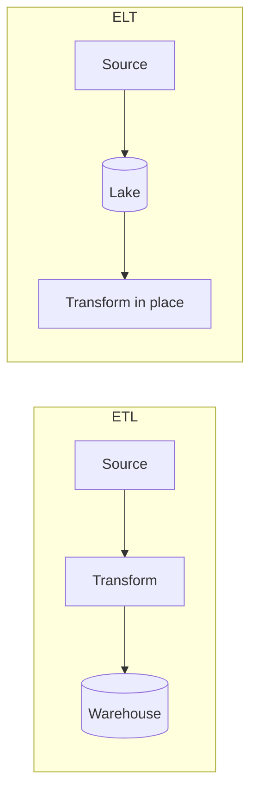

# Data Engineering

## Kinds of Data

- **Structured** — fixed schema; relational tables, well-formed CSV.
- **Semi-structured** — schema is present but must be teased out: JSON, XML, log files, email headers.
- **Unstructured** — text, images, audio, video. Needs transformation/feature extraction before processing.

## The Vs of Data

- **Volume** — how much.
- **Velocity** — how fast it arrives (batch vs. streaming).
- **Variety** — how many shapes/sources.
- *(Often extended with **Veracity** (quality/trust) and **Value**.)*

## Warehouse vs. Lake vs. Lakehouse vs. Mesh

- **Data Warehouse** — schema-on-write, optimized for BI/SQL analytics. Redshift, BigQuery, Snowflake. Classic **ETL**.
- **Data Lake** — schema-on-read, raw data in cheap object storage (S3). **ELT** (load first, transform later).
- **Lakehouse** — warehouse semantics (ACID, schema) on lake storage. **Delta Lake**, Apache Iceberg, Hudi; AWS Lake Formation + Redshift Spectrum; Databricks.
- **Data Mesh** — an *organizational* pattern: domain ownership of data-as-a-product, federated governance. Not a specific technology; may use Glue/Lake Formation underneath.

## ETL vs. ELT

ELT wins when storage is cheap and compute is elastic (the cloud default).

## Common File Formats

- **CSV/JSON** — human-readable, row-based, no schema enforcement.
- **Avro** — row-based, embedded schema; good for streaming/write-heavy.
- **Parquet / ORC** — **columnar**, compressed; ideal for analytical scans (read only the columns you need).

## On AWS

- **Glue** — serverless ETL + Data Catalog; **Schema Registry** for discovery & compatibility.
- **Athena** — serverless SQL over S3 (Presto/Trino).
- **Redshift / Redshift Spectrum**, **EMR** (Spark), **[[Kinesis]]** for streaming, **Lake Formation** for governance.
- **Data lineage** — track origin/flow (e.g. Glue + Neptune + Spline).

## DB Performance Levers

- **Indexing** — avoid full scans; enforce uniqueness/integrity (costs writes).
- **Partitioning** — prune data scanned (by date, tenant).
- **Compression** — columnar compresses far better than row-based.
