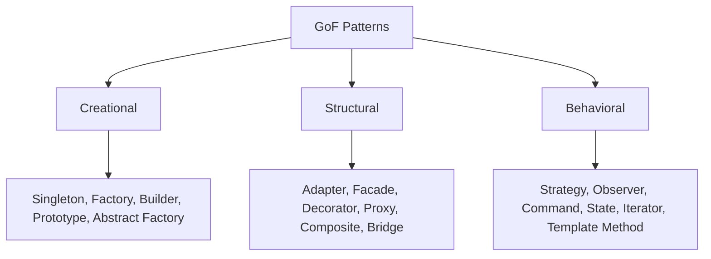

# Design Patterns

Reusable solutions to recurring design problems (Gang of Four). They're a shared vocabulary — name a pattern and a team knows the shape. Use them to *describe* a solution you've reached, not as a checklist to force onto code.

## Creational — *how objects are made*

- **Singleton** — one instance, global access. *Cons:* essentially a global; complicates testing and concurrency. Prefer dependency injection.
- **Factory Method / Abstract Factory** — create objects without hard-coding concrete classes; swap families behind an interface.
- **Builder** — assemble a complex object step by step; avoids telescoping constructors.
- **Prototype** — clone an existing object instead of constructing anew (costly init, or copying configured state).

## Structural — *how objects compose*

- **Adapter** — make an incompatible interface usable (wrapper).
- **Facade** — one simple interface over a complex subsystem.
- **Decorator** — add behavior by wrapping, without subclassing.
- **Proxy** — stand-in controlling access (lazy load, caching, auth).
- **Composite** — treat trees of objects uniformly (file system, UI).

## Behavioral — *how objects interact*

- **Strategy** — interchangeable algorithms behind one interface.
- **Observer** — subscribers react to a subject's changes (pub/sub roots).
- **Command** — encapsulate a request as an object (undo/redo, queues).
- **State** — behavior changes with internal state, no giant switch.
- **Template Method** — fixed skeleton, overridable steps.

> [!tip] Modern caveat
> Many GoF patterns paper over limits of older OO languages. In languages with first-class functions, *Strategy/Command/Observer* are often just functions, closures, and events. Reach for the simplest construct first.

## Beyond GoF

Distributed-systems patterns matter more at scale: see [[Messaging & Event-Driven Architecture]] (pub/sub, CQRS, saga, outbox) and [[Caching]] (cache-aside, write-through).
