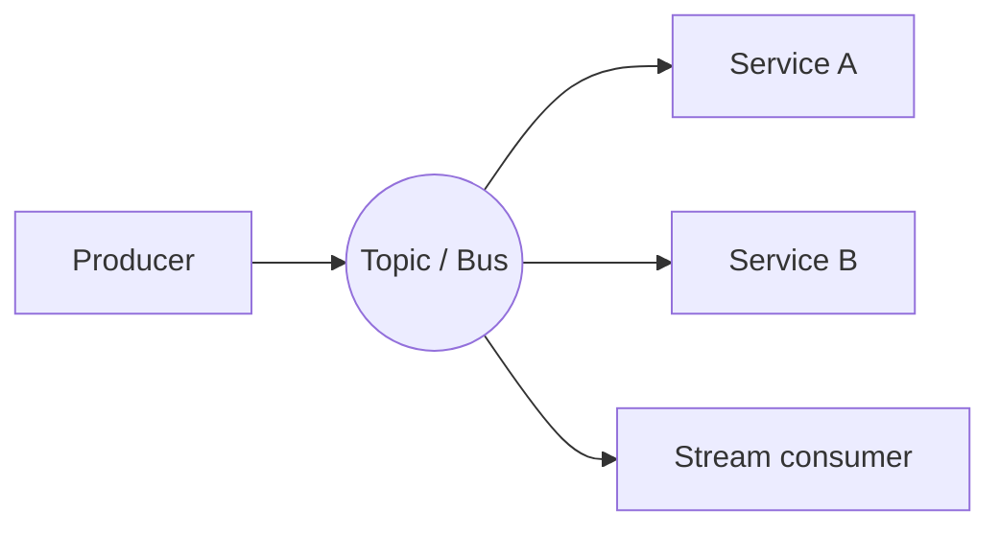

# Messaging & Event-Driven Architecture

Decouple components by communicating through messages instead of synchronous calls. Producers don't know (or wait for) consumers — which buys scalability, resilience, and independent evolution, at the cost of eventual consistency and harder debugging.

## Queues vs Pub/Sub vs Streams

- **Queue (point-to-point)** — one message, one consumer; work distribution. ([[SQS]])
- **Pub/Sub (fan-out)** — one event, many subscribers; notification. ([[SNS]], [[EventBridge]])
- **Log/Stream** — ordered, replayable, multiple independent consumers with their own offsets. ([[Kinesis]], Kafka)

## Delivery Semantics

- **At-most-once** — may drop, never duplicate.
- **At-least-once** — never drops, may duplicate → **consumers must be idempotent**.
- **Exactly-once** — hard/expensive; usually achieved as at-least-once + dedup.

## Core Patterns

- **Event notification** — "something happened"; thin event, consumer fetches details.
- **Event-carried state transfer** — fat event carries the data; consumers avoid callbacks.
- **Event sourcing** — store the *sequence of events* as the source of truth; rebuild state by replay.
- **CQRS** — separate write model from read model(s); pairs naturally with event sourcing.
- **Saga** — coordinate a distributed transaction as a series of local steps + compensating actions (choreography or orchestration via [[Step Functions]]).
- **Outbox** — write the event and the DB change in one local transaction; a relay publishes it — fixes the dual-write problem.

## Reliability Concerns

- **Idempotency keys** — dedupe at-least-once delivery.
- **Dead-letter queues** — quarantine poison messages for inspection/replay.
- **Ordering** — only guaranteed within a partition/message-group; design so global order isn't required.
- **Back-pressure** — queues smooth spikes but can hide a consumer that's permanently too slow — alarm on queue depth and age.

## Choosing on AWS
[[SQS]] (work queue) · [[SNS]] (fan-out) · [[EventBridge]] (routing/SaaS/schema) · [[Kinesis]] (ordered replayable stream) · [[Step Functions]] (orchestration).
