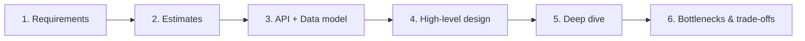

# System Design Interview

A repeatable framework for open-ended design problems. The goal is to show you can take an ambiguous prompt, narrow scope, propose options, and defend trade-offs — not to recite a "correct" diagram.

## The Loop (≈45–60 min)

### 1. Define the problem (don't skip)
- Ask questions to **shrink scope**: goals, who the clients are, what's in/out of scope, existing systems to integrate with.
- State functional requirements, then non-functional ones (latency, availability, consistency, scale).

### 2. Capacity estimates (back-of-envelope)
- DAU → QPS (peak ≈ 2–10× average), read:write ratio, storage/year, bandwidth.
- These numbers justify later choices (cache? shard? CDN?).

### 3. API & data model
- Translate requirements into a few endpoints (`send_message`, `get_messages`).
- Pick the API style: REST, GraphQL, gRPC. Sketch the core entities and access patterns first (they drive the DB choice).

### 4. High-level design
- Layers: client → CDN/edge → API/LB → services → data stores → async workers/streaming.
- Place caches and queues deliberately; show the happy path end-to-end.

### 5. Deep dive
- Pick the 1–2 hardest parts and go deep: sharding strategy, hot keys, consistency model, idempotency, fan-out on read vs write.

### 6. Bottlenecks & trade-offs
- Single points of failure, the next scaling wall, and how you'd evolve. Name the trade-offs explicitly — that's the signal interviewers want.

## Toolbox to Reach For
- **Scale reads:** [[Caching]], read replicas, CDN.
- **Scale writes:** sharding/partitioning, async via queues ([[Messaging & Event-Driven Architecture]]).
- **Decouple:** queues, pub/sub, event-driven.
- **Consistency:** know your [[CAP Theorem & Consistency]] position per data set.

## Cross-Cutting (enterprise)
i18n · accessibility · security · caching · DB indexing · observability.

## DORA-style KPIs
Deployment frequency · lead time for change · change-failure rate · mean time to recovery.

## Questions Worth Asking
- How much of the role is building vs. designing/presenting?
- Do we have paying customers? What's the real scale today vs. aspirational?
